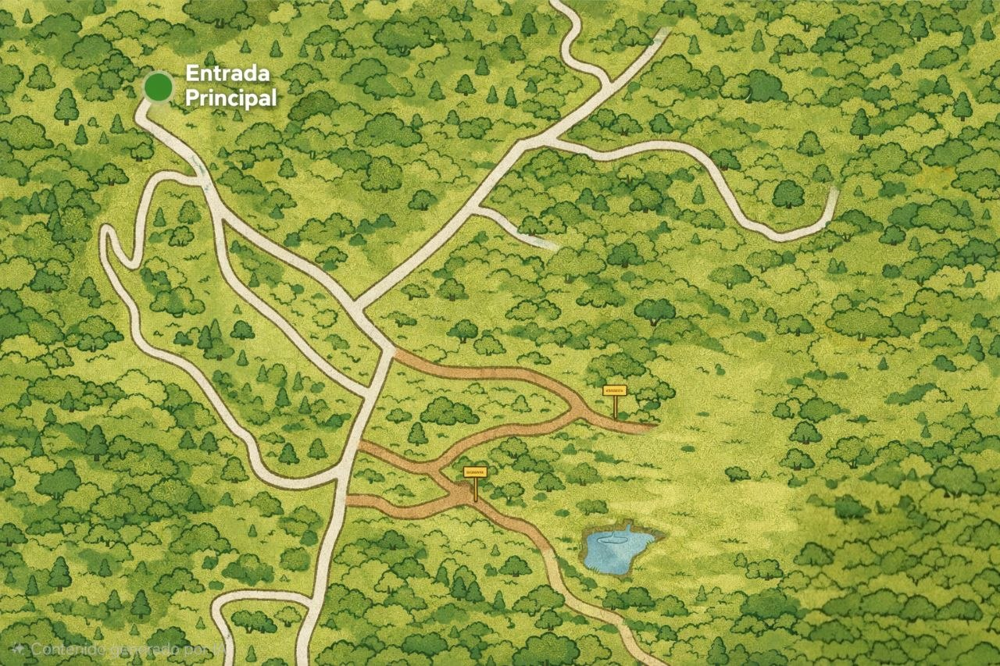

# Mapa interactivo de Tierras Gosén

[](https://github.com/Stryker0213/mapa-tierras-gosen/actions/workflows/validate.yml)

Sitio web mobile-first para orientar a los visitantes de Tierras Gosén mediante un mapa ilustrado de la propiedad. Permite descubrir alojamientos, zonas educativas, miradores, senderos y experiencias desde el teléfono, usando búsqueda, filtros y fichas con fotografías.



## Funcionalidades

- Portada optimizada para dispositivos móviles.
- Mapa interactivo construido con [Leaflet](https://leafletjs.com/).
- Marcadores personalizados por categoría.
- Búsqueda por nombre y descripción, sin distinguir mayúsculas ni tildes.
- Filtros por alojamiento, educativo, mirador, sendero y experiencia.
- Panel inferior adaptable con las fichas de los lugares.
- Fotografías con carga diferida para reducir el consumo de datos.
- Enlaces opcionales de reservación desde cada punto.
- Apertura directa de un lugar mediante `mapa.html?p=<id>`.
- Navegación por teclado y atributos accesibles en los controles principales.
- Validación automática del contenido y pruebas de los filtros.

## Tecnologías

- HTML5 y CSS3
- JavaScript sin frameworks
- Leaflet 1.9.4
- Cloudflare D1 (SQL) para los puntos de interés
- Cloudflare R2 para las imágenes nuevas
- Inicio de sesión con ChatGPT y lista privada de administradores
- React y Vinext para el panel administrativo
- Node.js 22 para compilación, validaciones y pruebas
- GitHub Actions para integración continua

La experiencia está preparada para mantener el mapa público y el módulo `/admin` privado. La primera versión desplegada permanece temporalmente restringida al propietario mientras se revisa. Los datos se sirven desde una API respaldada por D1 y las imágenes nuevas se guardan en R2. Si la API no está disponible, el mapa conserva `data/puntos.json` como contenido inicial de respaldo. Leaflet se carga desde un CDN.

## Ejecutar el proyecto localmente

Instala las dependencias y abre el entorno local:

```bash
git clone https://github.com/Stryker0213/mapa-tierras-gosen.git
cd mapa-tierras-gosen
npm install
npm run dev
```

Después abre:

- Portada: <http://localhost:3000/>
- Mapa: <http://localhost:3000/mapa.html>
- Administración: <http://localhost:3000/admin>

## Estructura principal

```text
.
├── .github/workflows/validate.yml  # Validación continua
├── .openai/hosting.json            # Base, archivos y proyecto de despliegue
├── app/
│   ├── admin/                      # Editor privado y adaptable
│   └── api/                        # Puntos, autorización e imágenes
├── assets/
│   ├── icons/                      # Iconos de categorías
│   └── logos/                      # Recursos de identidad visual
├── css/
│   ├── bienvenida.css              # Estilos de la portada
│   └── styles.css                  # Estilos del mapa
├── data/puntos.json                # Contenido de los puntos de interés
├── images/
│   ├── mapa.jpg                    # Fondo ilustrado del mapa
│   └── Imagenes*/                  # Fotografías de los lugares
├── js/
│   ├── filters.js                  # Búsqueda y filtrado
│   └── map.js                      # Mapa, marcadores y controles
├── db/schema.ts                    # Esquema SQL de puntos
├── drizzle/                        # Migraciones versionadas
├── scripts/validate-content.mjs    # Validador de datos y archivos
├── test/filters.test.cjs           # Pruebas unitarias
├── vite.config.ts                  # Compilación y servicios enlazados
└── mapa.html                       # Experiencia del mapa
```

## Administrar puntos de interés

El panel privado está disponible en `/admin`. Solo las cuentas incluidas en la variable segura `ADMIN_EMAILS` pueden entrar; la comprobación se realiza tanto para la página como para cada operación de escritura.

Desde el panel se puede:

- Crear, editar y eliminar puntos de interés.
- Mostrar u ocultar un punto sin borrarlo.
- Colocar el marcador con un clic o arrastrarlo sobre el mapa.
- Ajustar la posición un píxel a la vez o alinearla a una cuadrícula de 5 px.
- Subir varias imágenes JPG, PNG, WebP o AVIF de hasta 8 MB.
- Editar categoría, descripción y enlace de reservación.

[`data/puntos.json`](data/puntos.json) conserva los 15 puntos originales como semilla. Los cambios del panel se guardan como registros SQL que reemplazan esa base inicial. Cada punto mantiene esta estructura pública:

```json
{
  "id": "mirador-atardecer",
  "nombre": "Mirador del Atardecer",
  "categoria": "mirador",
  "x": 495,
  "y": 450,
  "descripcion": "Perfecto para ver el atardecer.",
  "imagenes": ["images/ImagenesMirador/mirador-atardecer.webp"],
  "airbnb": "https://www.airbnb.com/rooms/...",
  "activo": true
}
```

### Campos

| Campo | Requerido | Descripción |
| --- | --- | --- |
| `id` | Sí | Identificador único, estable y apto para URL. |
| `nombre` | Sí | Nombre visible del lugar. |
| `categoria` | Sí | `alojamiento`, `educativo`, `mirador`, `sendero` o `experiencia`. |
| `x` | Sí | Posición horizontal dentro del mapa, entre `0` y `1280`. |
| `y` | Sí | Posición vertical de Leaflet, entre `0` y `853`. |
| `descripcion` | Sí | Texto breve que aparece en la ficha y el popup. |
| `imagenes` | Sí | Lista de rutas locales; la interfaz actual utiliza la primera. |
| `airbnb` | No | URL HTTPS para mostrar el botón de reservación. |
| `activo` | Sí | Determina si el punto aparece en el sitio público. |

Leaflet recibe cada posición como `[y, x]`. El sistema de coordenadas corresponde al fondo `images/mapa.jpg`, cuyas dimensiones de referencia son **1280 × 853 px**. Si se cambia esa proporción, también deben revisarse los límites y las posiciones en `js/map.js`.

Después de modificar la semilla, ejecuta `npm run check`. El validador detecta identificadores repetidos, categorías incorrectas, coordenadas fuera del mapa, imágenes inexistentes y enlaces inválidos.

## Imágenes de los lugares

Para mantener una apariencia consistente y una descarga rápida en móviles:

- Tamaño recomendado: **1200 × 800 px**.
- Proporción: **3:2 horizontal**.
- Formato preferido: **WebP**.
- Peso recomendado: entre **100 y 250 KB**.
- Mantener el elemento principal cerca del centro, porque las miniaturas usan `object-fit: cover`.
- Usar nombres sin espacios ni caracteres especiales, por ejemplo `sendero-rio.webp`.

## Validaciones

Requiere Node.js 22.13 o posterior.

```bash
npm run check
```

El comando realiza:

1. Comprobación de sintaxis de JavaScript.
2. Validación de `data/puntos.json` y sus archivos relacionados.
3. Pruebas unitarias de búsqueda y filtrado.
4. Verificación de tipos y compilación de todas las rutas públicas y privadas.

También puedes ejecutar solamente las pruebas:

```bash
npm test
```

GitHub Actions ejecuta las mismas comprobaciones en cada pull request y en los cambios que llegan a `main`.

## Despliegue

El proyecto ahora necesita un entorno compatible con Cloudflare Workers, D1 y R2. La configuración de despliegue está en `.openai/hosting.json` y la migración SQL inicial en `drizzle/`.

### Versión publicada

- Sitio: <https://mapa-tierras-gosen.stryker1350.chatgpt.site>
- Estado actual: acceso privado para revisión.
- Panel administrativo: `/admin`.

Cuando se habilite el acceso público del sitio, el mapa y la portada podrán visitarse sin iniciar sesión. El panel `/admin` seguirá protegido mediante inicio de sesión y la lista `ADMIN_EMAILS`; las operaciones administrativas también validan esta autorización en el servidor.

## Seguridad del panel

- La ruta `/admin` redirige a inicio de sesión.
- Una sesión válida no basta: el correo también debe aparecer en `ADMIN_EMAILS`.
- Las API de creación, edición, eliminación y carga de imágenes repiten la misma autorización en el servidor.
- El mapa público solo recibe puntos marcados como activos.
- Las imágenes se validan por formato y tamaño antes de guardarse.

## Flujo de contribución

1. Crea una rama desde `main`.
2. Realiza y prueba los cambios localmente.
3. Ejecuta `npm run check`.
4. Abre un pull request hacia `main`.
5. Integra el cambio únicamente cuando `Validate site` haya finalizado correctamente.

## Repositorio

[Stryker0213/mapa-tierras-gosen](https://github.com/Stryker0213/mapa-tierras-gosen)
